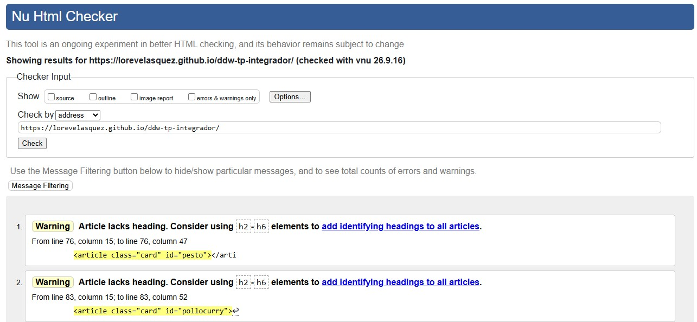
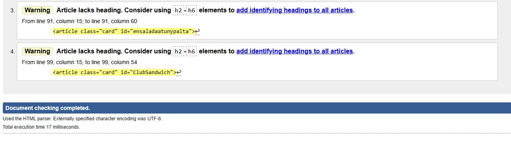
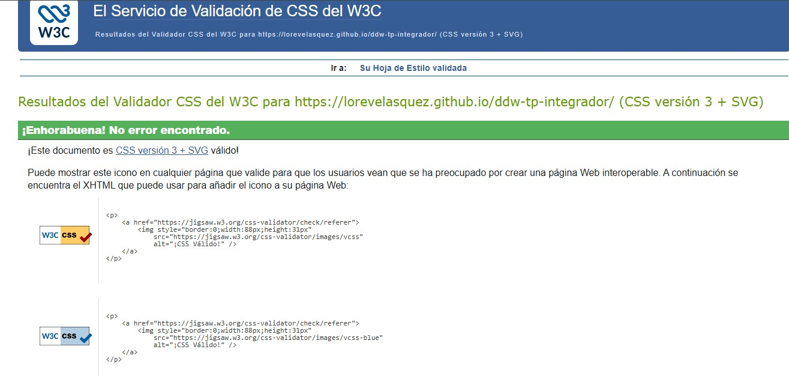

# Sitio de Recetas
## Cocina y Sabor

Trabajo Práctico Integrador · Diseño y Desarrollo Web · UADE

Sitio desarrollado con HTML5, CSS3 y Flexbox, sin JavaScript (se incorporará en el Parcial 2). Presenta recetas caseras variadas, con navegación por anclas y diseño responsive para escritorio y tablet.

**Sitio publicado**: https://lorevelasquez.github.io/ddw-tp-integrador/

---

## Secciones del sitio

- **Inicio** — header con logo y menú de navegación, seguido de un hero con imagen de fondo y presentación del sitio.
- **Nosotros** — texto sobre la propuesta de Cocina y Sabor.
- **Recetas** — 4 recetas presentadas en cards, con link a la receta completa.
- **Galería** — fotos de utensilios e ingredientes.
- **Contacto** — dentro del footer, con datos de contacto y redes sociales.

## Tecnologías utilizadas
- HTML5 semántico
- CSS3 con Flexbox
- Google Fonts

## Integrantes
Ver detalle completo en [`integrantes.txt`](./integrantes.txt).

- Giménez Balestra, Leonardo Gabriel - Comisión: Viernes Noche - leogimenez@uade.edu.ar
- Romano, Lautaro Marcos - Comisión: Viernes Noche - laromano@uade.edu.ar
- Velasquez, Lorena Isabel - Comisión: Viernes Noche - lvelasquez@uade.edu.ar

## Navegadores probados
- Google Chrome
- Microsoft Edge
- Mozilla Firefox

## Horas aproximadas

- **Estructura HTML y contenido**: ~6 horas
- **Diseño y estilos CSS**: ~7 horas
- **Integración de ramas y uso de GitHub**: ~5 horas

**Total aproximado**: ~18 horas (repartidas entre los 3 integrantes)

## Validación W3C
- **HTML**: 0 errores (quedan 4 warnings menores de tipo "article lacks heading", no bloqueantes)

- **CSS**: 0 errores, CSS3 válido
